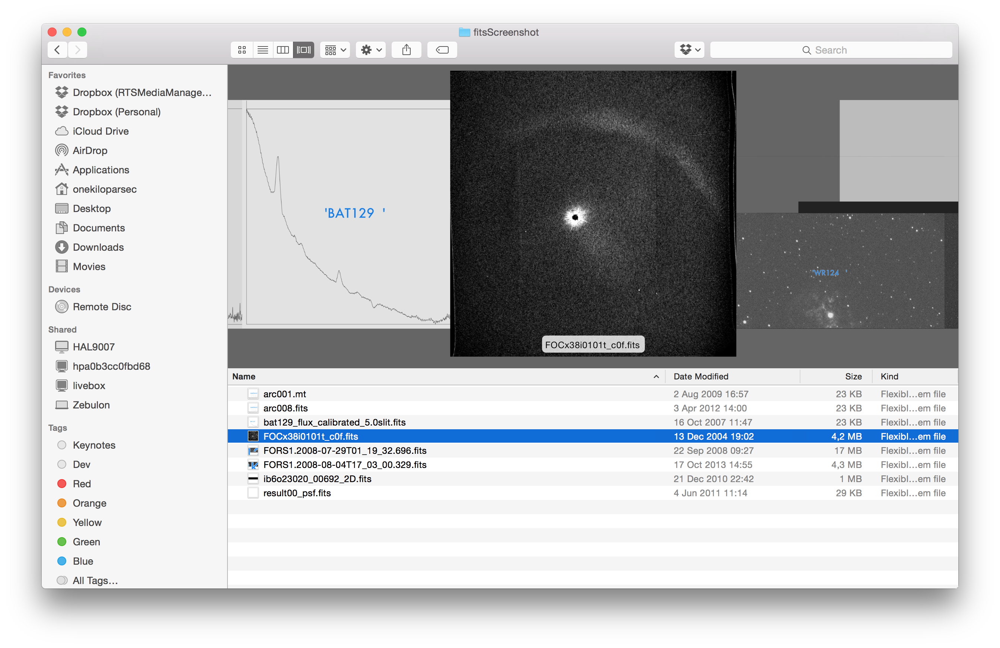
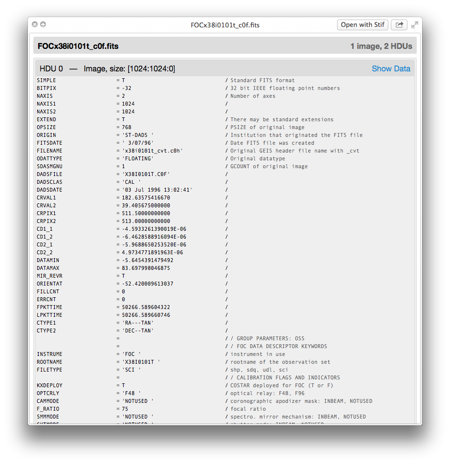
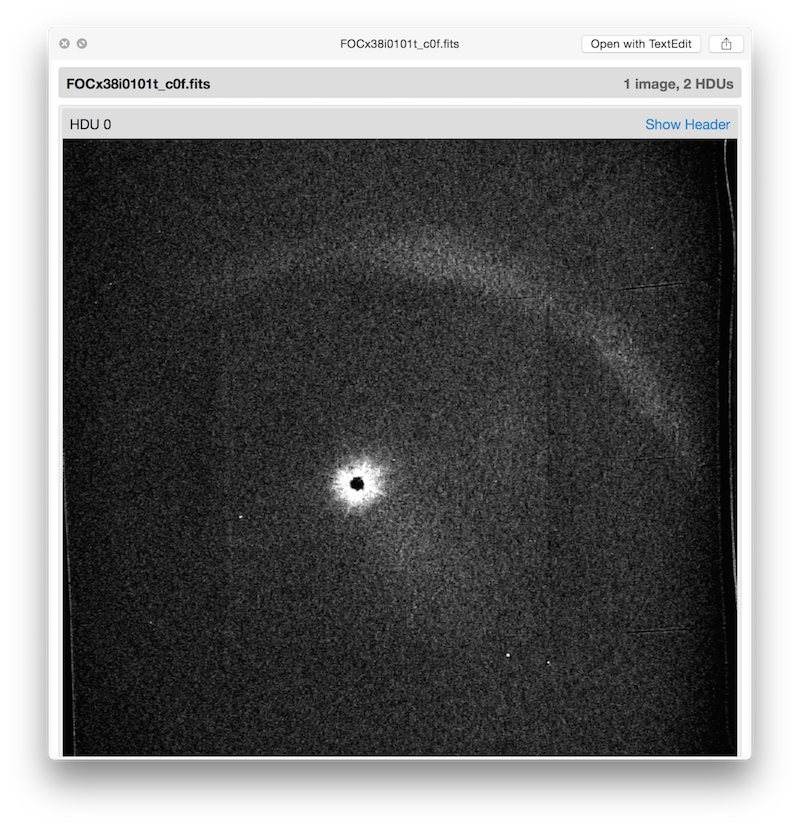
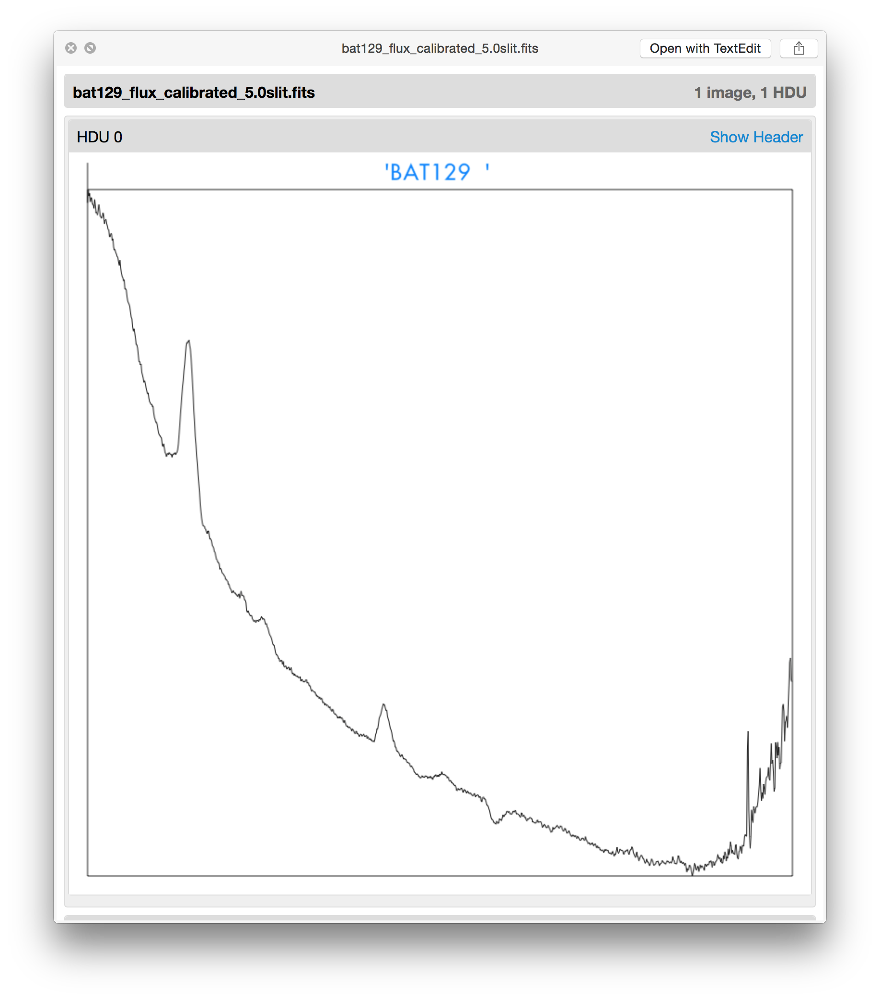
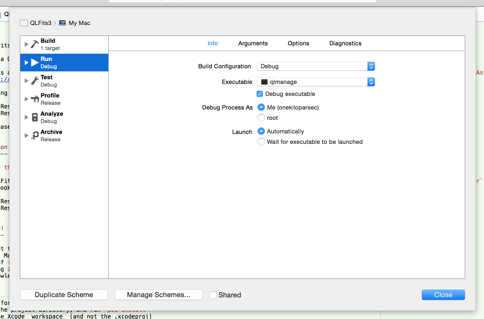
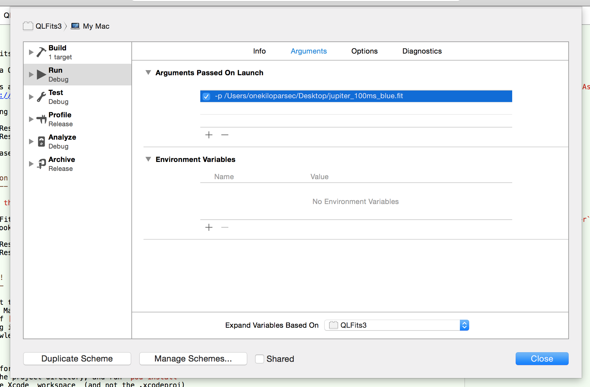

QLFits 3
========

_Note: QLFits2 was broken on OX 10.9 Mavericks! This is the new QLFits3. It works for Mavericks (10.9) and up._
_Update (March 2015): QLFits3 had some troubles displaying images. It was due to a bug in OSX 10.10 Yosemite (and 10.9 Mavericks). It has been worked around._

QLFits is a OSX Quicklook plugin for FITS (Flexible Image transport System) files (used by astronomers worldwide to store and share their data.)

QLFits 3 is an entirely new implementation of QLFits, using the open-source projects [ObjCFITSIO](https://github.com/onekiloparsec/ObjCFITSIO) and [AstroCocoaKit](https://github.com/onekiloparsec/AstroCocoaKit)

Enjoy seeing the content of your FITS files in the Finder:

It is released open source under the [GNU General Public Licence](http://en.wikipedia.org/wiki/GNU_General_Public_License).

QLFits3 open the following extensions: fits, fit, fts, ft, mt, imfits, imfit, uvfits, uvfit, pha, rmf, arf, rsp, pi. (See Info.plist file inside QLFits3.qlgenerator in case of doubt.) If your FITS file is not recognized, let me know (cedric at onekilopars.ec), the dynamic OSX type of your file might not be included in the list. See below to see what dynamic types QLFits3 recognises.

QLFits3 show all HDU  headers, and draw (when possible) all 2D images and 1D spectra.

Installation
------------

*[Download the latest binary](http://onekilopars.ec/softwares/QLFits3.qlgenerator.zip)*

Put the QLFits3.qlgenerator bundle in _/Library/QuickLook_ (not in _~/Library/QuickLook_) and run the (safe and instantenous) command: `/bin/sh qlmanage -r` to reset the quicklook daemon. 

Contribute!
-----------

If you want to contibute, you need:
* A recent Mac
* A copy of [Xcode](https://itunes.apple.com/fr/app/xcode/id497799835?l=en&mt=12) (Xcode 6, as of now, March 2015, but Xcode 5 should also work)
* A working installation of [Carthage](https://github.com/Carthage/Carthage) (Install it with [Homebrew](http://brew.sh): `brew install carthage`)
* Some knowledge of Objective-C and C... and FITS!

Then, 

1. simply fork this project on GitHub, 
2. Go to the project directory, and run `carthage update`
3. Open QLFits3.xcproj and make your modifications (I can help), 
4. Test – see Debugt below (I can also help, if time permits, business as usual), 
5. Submit a pull request (via GitHub)!

How to debug
------------

* Build your (modified) QLFits3. Now, a new version is being put in /Library/QuickLook
* Navigate in the Finder to look for a FITS file, and press <space>.

Alternate method. _Note: What follows is supposed to work, but a bug in Yosemite prevents it._
In Xcode, you should locate the `qlmanage` binary file, and include it as the "Executable" in the "Run" section of the "QLFits3" scheme. To do so:

* Edit the "QLFits3" scheme in Xcode, select the "Run section"
* Choose "Other..." in the drop down, a 'Open Dialog' will open.
* Type `open -a Finder /user/bin/qlmanage` in a Terminal.
* Drag & Drop the 'qlmanage' executable from the Finder anywhere in the Open Dialog.
* Click "Choose" and close the dialog.

Now one can "Run" the QLFits3 project from within Xcode. But we haven't yet told it what to do exactly at run. So go back to the QLFits3 scheme, and choose the 'Arguments' tab of the same "Run" section. In the section "Arguments Passed On Launch" add `-p <path/to/any/of/your/fits/file>`

Use `-t` to create thrumbnails instead of previews. You can put multiple entries here, but only the first selected one will be used once qlmanage runs.

Project Notes For Developers
----------------------------

Note that you can use [FITSImporter](https://github.com/onekiloparsec/FITSImporter), the OSX Spotlight plugin for FITS file as good companion.

* There is a Copy Files build phase that puts the Debug build of Provisioning.qlgenerator in your /Library/QuickLook folder.

* QuickLook plug-ins sometimes don't like to install. Learn to use "qlmanage -r" to reset the daemon. Using "qlmanage -m plugins" will tell you if the plug-in has been recognized. Sometimes you have to login and out before the plug-in is recognized.

OSX dynamic types
-----------------

For custom or special file extensions, OSX assign dynamic types. QLFits3 contains a list of such types to allow it to recognize them (in addition to the filename extension.) To check the dynamic type of your FITS file, open a Terminal and type the following command `mdls <path/to/your/file> | grep kMDItemContentType`. You shluld obtain something like `kMDItemContentType             = "dyn.ah62d4rv4ge80q4pysq"`. 

List of known extensions: (See Info.plist file inside QLFits3.qlgenerator for the exact list):

* gov.nasa.gsfc.fits
* gov.nasa.gsfc.fits-header
* com.sao.SAOImageDS9
* dyn.ah62d4rv4ge80q4pysq
* dyn.ah62d4rv4ge80q4py
* dyn.ah62d4rv4ge80q7a
* dyn.ah62d4rv4ge8047a
* dyn.ah62d4rv4ge81a4db
* dyn.ah62d4rv4ge80c6xg
* dyn.ah62d4rv4ge81e5pg
* dyn.ah62d4rv4ge81e65u
* dyn.ah62d4rv4ge81a4k
* dyn.ah62d4rv4ge80w5pgrf4a
* dyn.ah62d4rv4ge81n7xgrf4a
* dyn.ah62d4rv4ge80w5pgrf4hg
* dyn.ah62d4rv4ge81n7xgrf4hg
* dyn.ah62d4rv4ge80262
* dyn.ah62d46dzqm0gw23ssz1gw8brqz6gn25zsvu0e5dfhk2x43xmsu
* dyn.ah62d46dzqm0gw23ssz1gw8brqz6gn25zsvu0e5dfhk2x43xmsv3u

