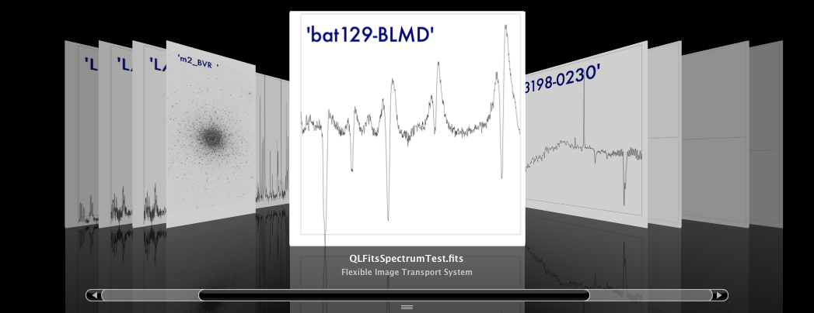
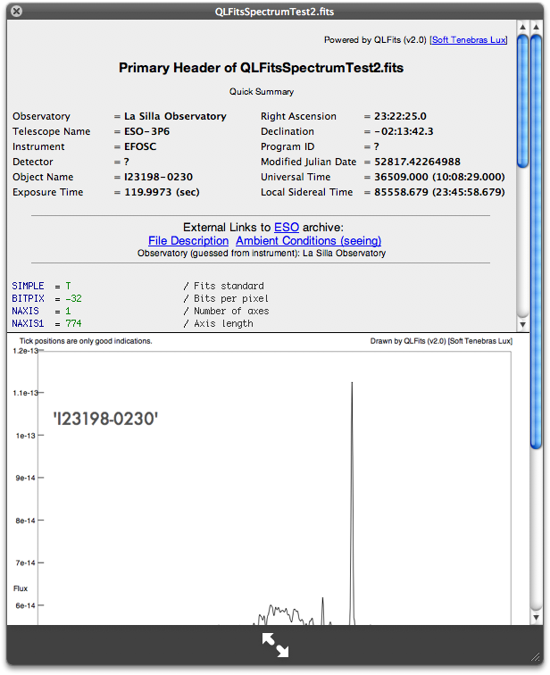
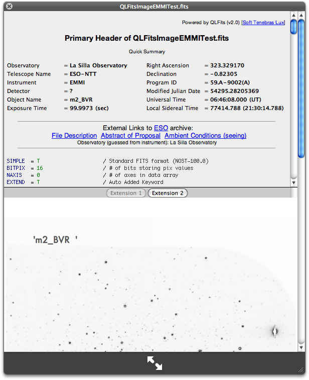
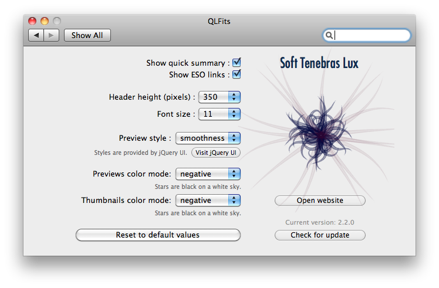

QLFits 2
========

_Note: QLFits is broken on OX 10.9 Mavericks! This is the QLFits2 branch conserved for historical purpose. Use the master branch to follow QLFits development._

QLFits is a OSX Quicklook plugin for FITS (Flexible Image transport System) files (used by astronomers worldwide to store and share their data.)

[Direct download](http://onekilopars.ec/softwares/QLFits2.3.0.pkg) (from the onekilopars.ec' website).

It is released open source under the [GNU General Public Licence](http://en.wikipedia.org/wiki/GNU_General_Public_License).

The following command line is run at the end of the Xcode build phase to ensure the QuickLook daemon is restarted:

    /bin/sh qlmanage -r
    
Once done, you can enjoy seeing the content of your FITS files directly in the Finder!

 ([@onekiloparsec](https://twitter.com/onekiloparsec)). 

Note that you can use [FITSImporter](https://github.com/onekiloparsec/FITSImporter), the OSX Spotlight plugin for FITS file as good companion.

